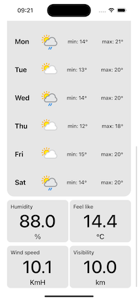

# WeatherApp

 

Один экран. Архитектура MVP.

Скролл. Внтури скрола располложены элементы:  
-вьюха  
-коллекции  
-стеки

Для работы с коллекциями добавил в проект вспомогательные классы Common->Collection->CustomCollection.

Добавил две библиотеки:  
-Alamofire  
-Snapkit

Данные хранятся в CoreData.

Часовые пояса высчитываются в зависимости от таймзоны.

При отображении данных из кеша значения из прошлого отбрасываются и отображаются акутальные для текущего времени.
Т.е. если через неделю открыть апп без интернета и там будут данные, то они отобразятся.

При чтении данных из кеша проверется по координатам удаленность от текущей позиции. Если в пределах 8км то данные отображаются. Если больше, то нет.

Настройка Цельсий/Фаренгейт берется из системных настроек девайса, в зависимости от указанного региона.
